<!--
  This README renders the SVG card + clickable badges on your GitHub profile.
  The card image is regenerated automatically by .github/workflows/main.yml.
  GitHub swaps dark/light versions based on the viewer's theme.
  The badges below are real, clickable links (the card image itself can't hold
  working links — GitHub strips them from SVGs — so the links live here).
-->

  <picture>
    <source media="(prefers-color-scheme: dark)"  srcset="./dark_mode.svg">
    <source media="(prefers-color-scheme: light)" srcset="./light_mode.svg">
    
  </picture>

  
  
  

